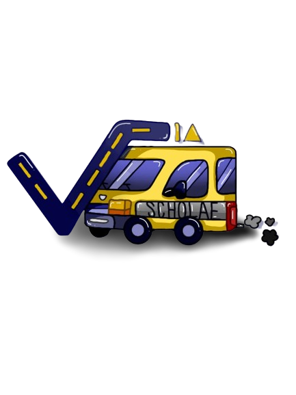

# Via Scholae

## 🚀 Sobre o Projeto
O **Via Scholae** é um sistema de acompanhamento de vans escolares, desenvolvido para proporcionar mais segurança e controle aos responsáveis pelo transporte dos alunos. A plataforma melhora a comunicação entre motoristas e responsáveis, garantindo maior transparência sobre o trajeto realizado até a escola.

## 🎯 Objetivo
O sistema permite que os responsáveis acompanhem, em tempo real, o trajeto realizado pelos motoristas, minimizando problemas como:
- Falta de confiança na segurança do transporte.
- Falhas na comunicação entre responsáveis e condutores.
- Preocupação com imprevistos durante o trajeto.

Com essa solução, aprimoramos a segurança do transporte escolar e oferecemos um recurso confiável para pais e motoristas.

## 📌 Funcionalidades
- 📍 **Rastreamento em tempo real** da van escolar.
- 📢 **Notificações automáticas** sobre eventos importantes no trajeto.
- 💬 **Canal de comunicação** entre motoristas e responsáveis.
- 🗺️ **Histórico de rotas e trajetos percorridos.**

## 📖 Metodologia
Para o desenvolvimento do projeto, foram utilizadas metodologias quantitativas, qualitativas e exploratórias, garantindo uma abordagem abrangente para a solução dos problemas identificados.

## 👥 Equipe de Desenvolvimento
Este projeto foi desenvolvido por:
- **Matheus Curci Romano**
- **Rebeca Matewanga Maria Kamalandua**
- **Revellin Mendes Ferreira**

## 🛠️ Tecnologias Utilizadas
- **React Native** (Desenvolvimento Mobile)
- **Expo** (Facilidade na implementação)
- **SQLite** (Banco de Dados Local)
- **Mapbox** (Geolocalização e Mapas)

## 📷 Demonstração
*Adicione aqui prints ou GIFs do funcionamento do aplicativo.*

## ⚖️ Direitos Autorais
© 2024 Via Scholae. Todos os direitos reservados.

---

*Desenvolvido com 💙 pela equipe Via Scholae* 🚐📍

